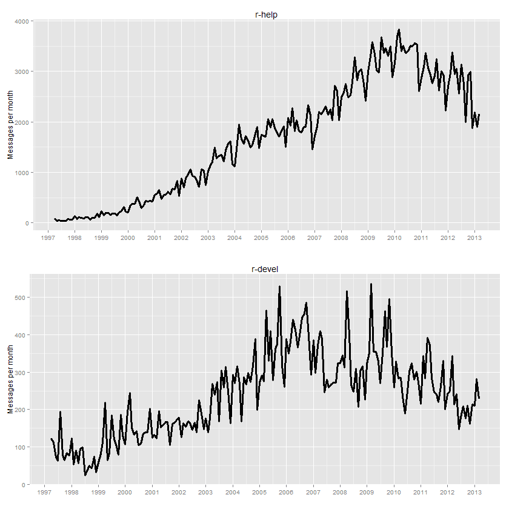

Today it's 16 years ago and 367,496 messages later since Martin Mächler started the R-help (321,119 msgs), R-devel (45,830 msgs) and R-announce (547 msgs) mailing lists [1] - a great benefit to all of us.  Special thanks to Martin and also thanks to everyone else contributing to these forums.

[1] https://stat.ethz.ch/pipermail/r-help/1997-April/001490.html
